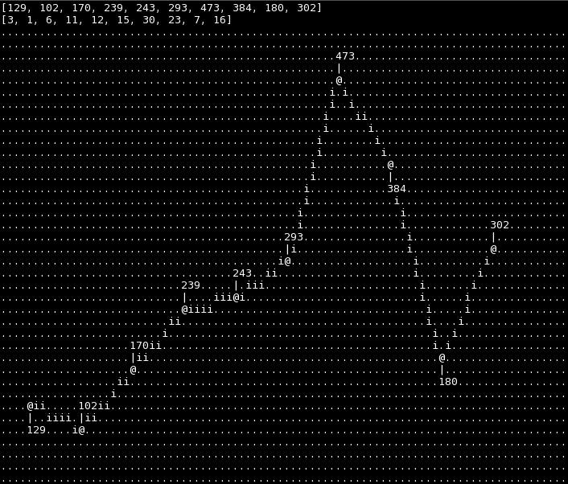
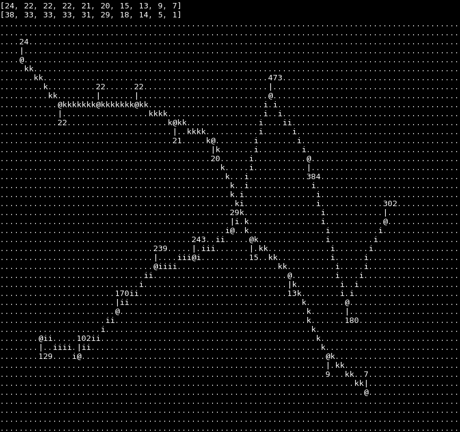

# Command Line Graphs

There are many CLI graphing tools out there. However, most of them focus on visualizing only. The numerical data behind the graph either gets lost or is displayed as a list of data points dissociated from the graph itself.

This tool makes graphs with actual inline annotations of the numerical values for each data point - in your comand line.



Symbols explained:

```
[a-zA-Z]    the actual graph line
@           the exact data point
|           a line connecting the data point ('@') with its numerical annotation
            (annotations are above or below the data point)
```

## Multiline Plots

Multiline plots are possible.



## Usage

```
$ ruby graph.rb
```
